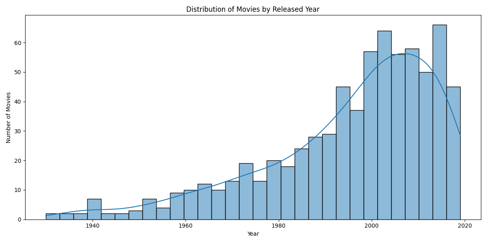

# Exploratory Data Analysis of Top IMDB Movies
---

## Introduction

This project performs a comprehensive Exploratory Data Analysis (EDA) on a dataset of top-rated movies from IMDB. The goal is to uncover insights, patterns, and relationships within the data through cleaning, analysis, and visualization.

The analysis explores various aspects of the movies, including their genres, release years, runtimes, ratings, and financial success.

## Dataset

The dataset used is `topimdb.csv`, containing information on 714 top-rated movies.

**Key columns include:**
* `Series_Title`: The title of the movie.
* `Released_Year`: The year the movie was released.
* `Certificate`: The content rating of the movie (e.g., PG, R, A).
* `Runtime`: The length of the movie in minutes.
* `Genre`: The movie's genre(s).
* `IMDB_Rating`: The rating on a scale of 1-10.
* `Meta_score`: The score from the review aggregator Metacritic.
* `Director`: The director of the movie.
* `No_of_Votes`: The number of votes received on IMDB.
* `Gross`: The worldwide gross revenue.

## Data Cleaning and Preparation

The raw dataset required several cleaning steps to prepare it for analysis:

1.  **Dropped Unnecessary Columns**: The `ID`, `Poster_Link`, and `Overview` columns were removed as they were not relevant to this quantitative analysis.
2.  **Standardized Numerical Columns**:
    * `Runtime`: The " min" suffix was removed, and the column was converted to an integer.
    * `Gross`: Commas were removed from the revenue figures, and the column was converted to a float.
    * `Released_Year`: A data entry error ('PG' in the year column) was identified and corrected. The column was then converted to an integer.
3.  **Feature Engineering**: A `Primary_Genre` column was created by extracting the first listed genre for each movie. This simplifies genre-based aggregation and analysis.

The resulting clean dataset is saved as `cleaned_imdb.csv`.

## Exploratory Data Analysis and Key Insights

Several visualizations were created to explore the dataset.

### 1. Correlation Between Numerical Features
A heatmap was used to understand the relationships between numerical variables.
* **Insight**: There is a moderate positive correlation (0.61) between `No_of_Votes` and `Gross` revenue, suggesting that more popular films (in terms of votes) tend to be higher-grossing. The relationship between `IMDB_Rating` and `Gross` is much weaker (0.15).


### 2. Distribution of Key Metrics
Histograms revealed the distribution of ratings, scores, runtime, and revenue.
* **Insight**: `IMDB_Rating` and `Meta_score` distributions are left-skewed, indicating most movies in this dataset are highly rated. The `Gross` revenue distribution is heavily skewed to the right, highlighting that a small number of blockbuster films earn vastly more than the others.


### 3. Genre Analysis
Bar charts were used to analyze the frequency and average ratings of different genres.
* **Insight**: **Drama** is the most common primary genre, followed by **Action** and **Comedy**. However, when looking at average ratings, **Animation**, **Biography**, and **Western** films tend to have the highest scores.


### 4. IMDB Rating vs. Gross Revenue
A scatter plot helped visualize the relationship between critical acclaim and commercial success.
* **Insight**: There is no strong, direct relationship. Many highly-rated films have modest gross revenues, and some commercially successful films have lower ratings, indicating that critical acclaim does not always translate to box office success.


### 5. Top Directors by Average Rating
The analysis identified directors who consistently produce highly-rated films.
* **Insight**: Directors like Frank Darabont, Christopher Nolan, and Stanley Kubrick are among the top performers in this dataset, with the highest average IMDB ratings for their films.


### 6. Movie Releases Over Time
A histogram showed the trend of movie production years within this dataset.
* **Insight**: The number of top-rated films released per year has generally increased over time, with a notable peak in the 2000s and 2010s.



## Project Files

* `topimdb.csv`: The original, raw dataset.
* `cleaned_imdb.csv`: The cleaned and preprocessed data file.
* `EDA_on_IMDB.ipynb`: The Python script used for the complete analysis.
* `correlation_heatmap.png`: Visualization of the correlation matrix.
* `histograms.png`: Visualizations of numerical feature distributions.
* `genre_counts.png`: Visualization of movie counts per genre.
* `genre_ratings.png`: Visualization of average ratings per genre.
* `rating_vs_gross.png`: Scatter plot of IMDB rating vs. gross revenue.
* `top_directors.png`: Visualization of top directors by average rating.
* `movies_by_year.png`: Visualization of movie releases over the years.
* `README.md`: This documentation file.

## How to Run the Analysis

1.  Ensure you have Python and the required libraries installed (see **Setup and Installation**).
2.  Place the `topimdb.csv` file in the same directory as the script.
3.  Execute the script from your command line or terminal:
    ```bash
    python EDA_on_IMDB.ipynb
    ```
4.  The script will print status updates to the console, save the `cleaned_imdb.csv` file, and generate all the `.png` visualization files in the project directory.
